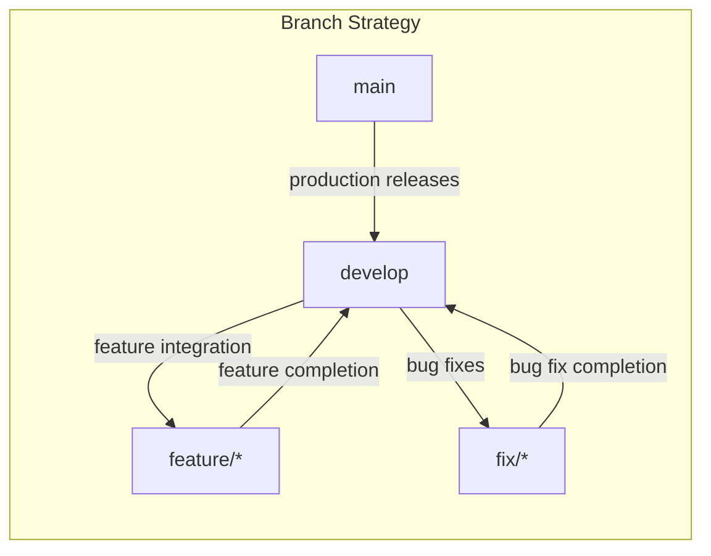

# Development Guide

## Core Development Principles

This project adheres to the following core development principles:

1.  **Platform Thinking**: Features are designed as modular, independent units with clear boundaries between domains. We aim to create reusable core services and plan for scalability from the start.
2.  **Code Minimalism**: We start with the minimal viable solution and add complexity only when necessary. Every additional feature and line of code must justify its complexity cost.
3.  **Refactoring Signals**: We continuously monitor for code quality signals such as duplicate code, unused optionals, and deep inheritance to trigger refactoring efforts.

## Development Standards

### 1. Type Safety

We enforce strong typing throughout the codebase, primarily using TypeScript.

```typescript
interface Feature {
    id: string;
    name: string;
    config: FeatureConfig;
}

function processFeature(feature: Feature): Result<Feature> {
    // Implementation
}
```

Avoid using implicit `any` types.

### 2. Error Handling

Consistent error handling is crucial. Use try-catch blocks to manage potential errors.

```typescript
try {
    await processData();
} catch (error) {
    if (error instanceof DomainError) {
        // Handle domain-specific errors
    }
    // Log and rethrow system errors
    throw error;
}
```

### 3. Testing Requirements

*   Write tests before or alongside code development.
*   Focus on testing behavior rather than implementation details.
*   Include tests for edge cases and error conditions.
*   Maintain high test coverage for business logic.

### 4. Code Quality

*   Keep functions small, focused, and single-purpose.
*   Use meaningful and descriptive names for variables and functions.
*   Document complex logic to explain the 'why' and not just the 'what'.
*   Perform regular refactoring to maintain code clarity and efficiency.

## Documentation Requirements

### 1. Code Documentation

*   Document the reasoning behind the code, not just its functionality.
*   Keep documentation close to the code it describes.
*   Update documentation whenever code changes are made.
*   Provide examples for complex logic to aid understanding.

### 2. Technical Documentation

*   Maintain and update `docs/development_guide.md` (this document).
*   Document architecture decisions, system dependencies, setup instructions, and troubleshooting guides.

## Review Standards

### 1. Code Review Process

*   Verify that code changes meet the specified requirements.
*   Check for proper error handling implementation.
*   Review performance implications of the changes.
*   Ensure that adequate testing is in place.
*   Validate that documentation is updated and accurate.

### 2. Quality Checklist

Before merging any code, ensure the following checklist is complete:

*   [ ] Type safety is enforced.
*   [ ] Error handling is implemented correctly.
*   [ ] Sufficient test coverage is provided.
*   [ ] Documentation is up-to-date.

## Maintenance Guidelines

### 1. Regular Tasks

*   Update project dependencies regularly to address security vulnerabilities and improve performance.
*   Remove any unused or obsolete code to reduce complexity.
*   Refactor complex sections of code to improve readability and maintainability.
*   Review error logs to identify and address recurring issues.
*   Keep `README.md` updated with current project information.
*   Maintain `docs/development_guide.md` with the latest development practices.
*   Update `docs/task.md` to reflect current tasks and project status.

## Version Control

### 1. Commit Standards

Follow conventional commit standards for commit messages:

```
type(scope): description

[optional body]

[optional footer]
```

### 2. Branch Strategy

*   `main`: For production-ready code.
*   `develop`: For integration of features.
*   `feature/*`: For new feature development.
*   `fix/*`: For bug fixes.



This `development.md` provides a comprehensive guide for developers contributing to the project, ensuring code quality, maintainability, and adherence to best practices.
